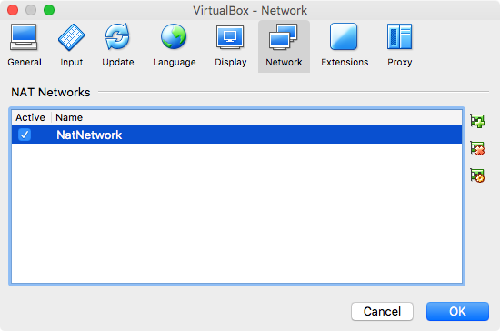
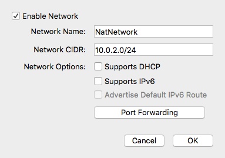
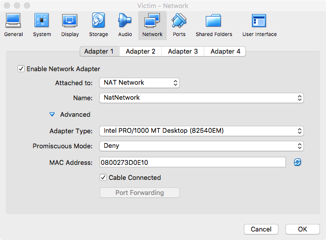
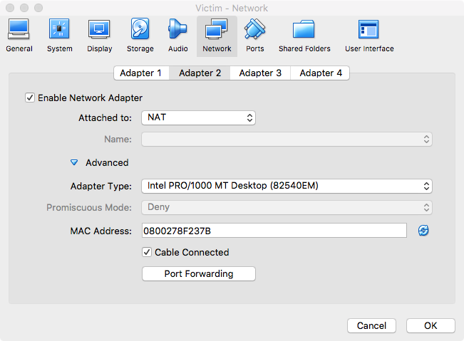
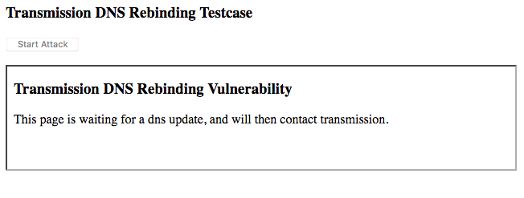

# How to demo

This document provides a step-by-step guide of how to set up two virtual machines so that this attack can be demonstrated.

## Setting up your VMs

- First of all download [VirtualBox](https://www.virtualbox.org/wiki/Downloads) (Or your favourite VM Manager)
- Get a hold of a clean copy of [Ubuntu 17.10](https://www.ubuntu.com/download/desktop) (This set up probably works with other versions, but untested.)
- Install Ubuntu 17.10 on two seperate VMs, designate one the Victim, the other the Attacker.

### Network Configuration

- Shutdown both VMs
- In VirtualBox Preferences/Settings go to the 'Network' Tab

- Create a new 'NAT Network' and configure it to disable DHCP & use CIDR `10.0.2.0/24`

- On each VM (Victim & Attacker) set up the networks to use the NAT Network you just created on Adapter 1

- Ensure the MAC Address of the 2 VMs is NOT the same...

- Set up Adapter 2 on each VM to 'NAT', again make sure the MAC Addresses are unique

### Victim Installation/Configuration

- Boot up your 'Victim' VM, and log in.
- Open a terminal window

- Install `git`: `sudo apt install git`
- Clone this repo: `git clone https://github.com/CGA1123/F20AN.git $HOME/F20AN`
- Run the installation script from `$HOME`: `cd $HOME; ./F20AN/victim-install.sh`
- Everything should install and the script *should* exit successfully!

### Attacker Installation/Configuration

- Boot up your 'Attacker' VM, and log in.
- Open a terminal window

- Install `git`: `sudo apt install git`
- Clone this repo: `git clone https://github.com/CGA1123/F20AN.git $HOME/F20AN`
- Run the installation script: `cd F20AN; ./attacker-install.sh`
- Run a http server on post 80 that will serve a `attack.sh` file
- (One is provided in the F20AN root and can be served by running `sudo python -m http.server 80`)

Your VMs are now set up!

### Running attack

From the victim machine open firefox and go to `http://10.0.2.30:9091` or just `http://10.0.2.30` if you ran a server on port 80 from the repo root

Click the `Start Attack` button, the iFrame should show the following either directly of after a few seconds:

If you don't force reload the page and click the `Start Attack` button again.

You will get a pop up telling you the attack was successful (if it is).

You should see a `.profile` file in the user `$HOME` also (it is this file that is run on log in).

The attack code will run whenever a new login shell is openened, or when the user logs in through the GUI.

You can test this out by running `bash -l` in the terminal, or logging out and in again.

